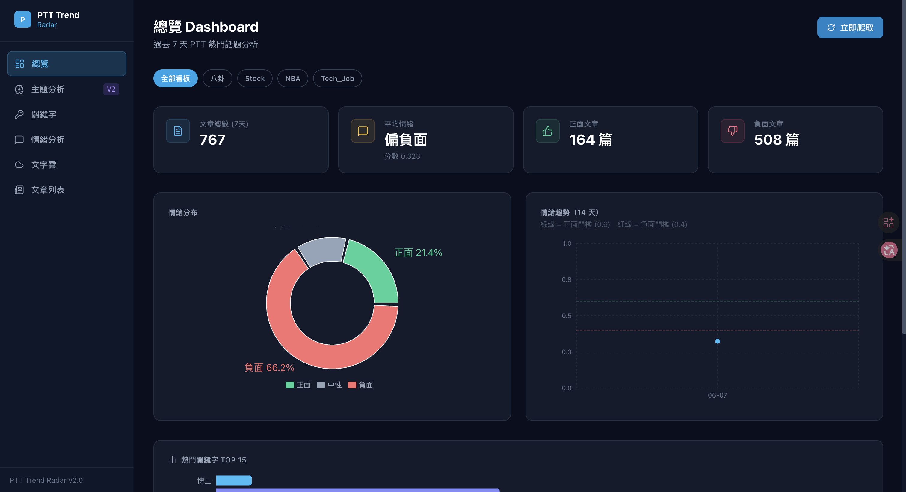
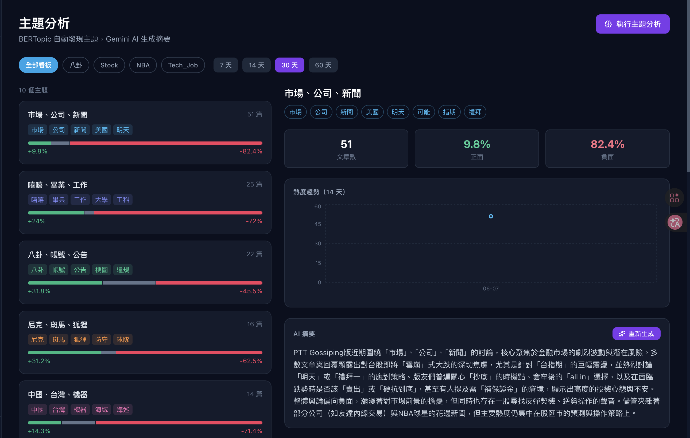
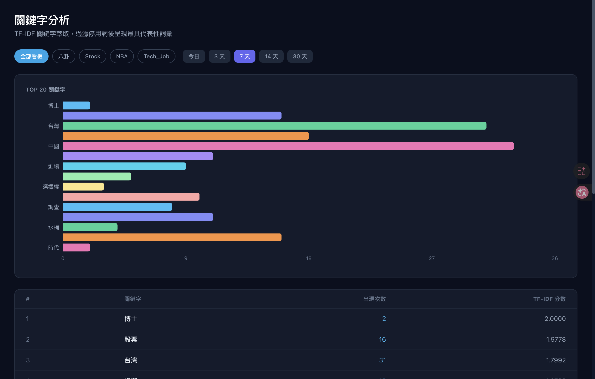
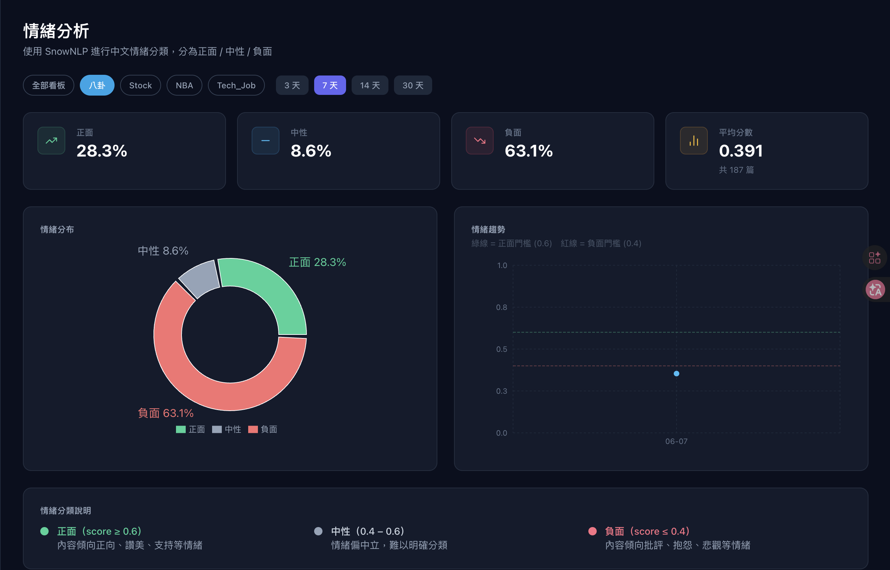
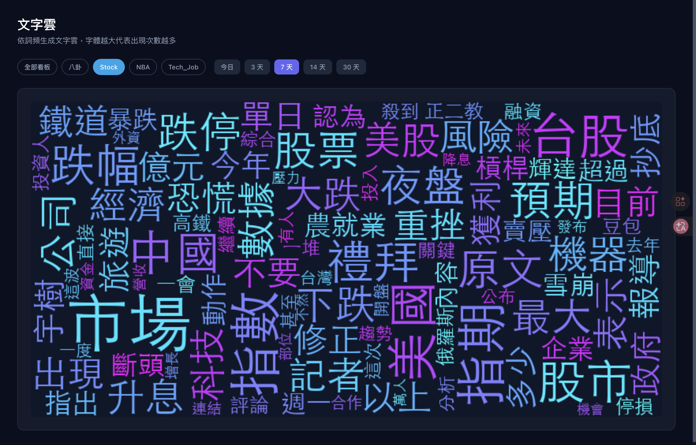
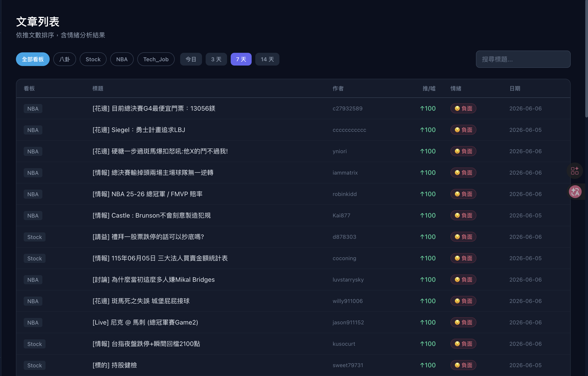
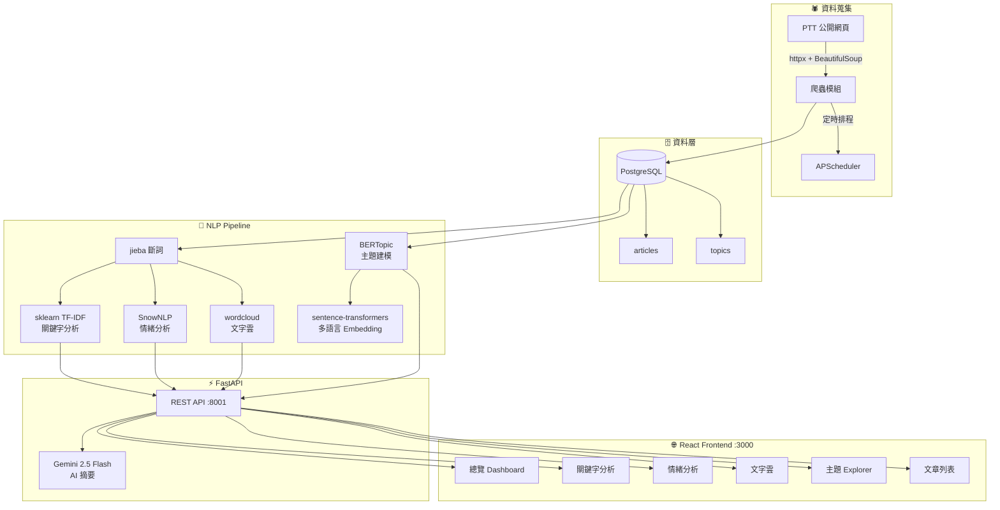

<div align="center">

# 📡 PTT Trend Radar

**PTT 熱門話題與情緒分析平台**

自動爬取 PTT 文章 → NLP 分析 → BERTopic 主題建模 → Gemini AI 摘要 → React Dashboard 視覺化

[](https://python.org)
[](https://fastapi.tiangolo.com)
[](https://react.dev)
[](https://typescriptlang.org)
[](https://postgresql.org)
[](https://docker.com)

</div>

---

## 📸 Screenshots

### 總覽 Dashboard


### 主題分析（BERTopic + Gemini AI）


### 關鍵字分析


### 情緒分析


### 文字雲


### 文章列表


---

## ✨ 功能特色

| 功能 | 技術 | 說明 |
|------|------|------|
| 🕷️ **PTT 爬蟲** | `httpx` + `BeautifulSoup` | 支援 4 個看板，APScheduler 定時自動爬取 |
| 🔑 **關鍵字分析** | `sklearn TF-IDF` + `jieba` | 中文斷詞、停用詞過濾、以內容為主的 TF-IDF |
| 💬 **情緒分析** | `SnowNLP` | 正 / 中 / 負分類，含每日趨勢折線圖 |
| ☁️ **文字雲** | `wordcloud` | 詞頻驅動，支援中文字型，base64 回傳 |
| 🧠 **主題建模** | `BERTopic` + `sentence-transformers` | 多語言 embedding，HDBSCAN 聚類，自動命名主題 |
| ✨ **AI 摘要** | `Gemini 2.5 Flash` | 每個主題生成 100-200 字繁體中文分析摘要 |
| 📊 **Dashboard** | `React` + `Recharts` + `TailwindCSS` | 暗色主題，圓餅圖 / 折線圖 / 長條圖 / Area Chart |

---

## 🏗️ 系統架構



---

## 🚀 快速開始

### 方式一：Docker（推薦，一行啟動）

```bash
git clone https://github.com/wei4211/ptt-trend-radar.git
cd ptt-trend-radar

cp .env.example .env
# 編輯 .env，填入 GEMINI_API_KEY

docker compose up --build
```

啟動完成後開啟瀏覽器：

> 🌐 **http://localhost:3000** ← 主要 Dashboard（從這裡使用）
>
> 📖 http://localhost:8001/docs ← API 文件（Swagger UI）

### 方式二：本地開發腳本

```bash
git clone https://github.com/wei4211/ptt-trend-radar.git
cd ptt-trend-radar

cp .env.example .env  # 填入 GEMINI_API_KEY

# 安裝 Python 依賴
pip install -r backend/requirements.txt

# 安裝 Node 依賴
cd frontend && npm install && cd ..

# 一鍵啟動（DB + Backend + Frontend）
bash start.sh
```

啟動完成後開啟瀏覽器：

> 🌐 **http://localhost:3000** ← 主要 Dashboard（從這裡使用）
>
> 📖 http://localhost:8001/docs ← API 文件（Swagger UI）

#### 首次使用：爬取文章資料

啟動後 Dashboard 會是空的，需要先爬取一次：

```bash
# 爬取所有看板（約 3-5 分鐘）
curl -X POST "http://localhost:8001/api/scraper/trigger/sync"
```

或直接在 Dashboard 點右上角的「**立即爬取**」按鈕。

---

## ⚙️ 環境變數

| 變數 | 說明 | 必填 |
|------|------|------|
| `GEMINI_API_KEY` | Google AI Studio API Key | ✅ |
| `DATABASE_URL` | PostgreSQL 連線字串 | ✅ |
| `SCRAPE_INTERVAL_MINUTES` | 自動爬取間隔（分鐘，預設 60） | ❌ |

> 申請 Gemini API Key：https://aistudio.google.com/apikey

---

## 📡 API 文件

啟動後開啟 http://localhost:8001/docs 查看完整 Swagger 文件

<details>
<summary>查看主要 Endpoints</summary>

| Method | Endpoint | 說明 |
|--------|----------|------|
| `POST` | `/api/scraper/trigger/sync` | 立即爬取所有看板 |
| `GET` | `/api/analysis/overview` | 文章數、平均情緒概覽 |
| `GET` | `/api/analysis/keywords` | TF-IDF 關鍵字排行 |
| `GET` | `/api/analysis/sentiment` | 情緒分布（正/中/負 %） |
| `GET` | `/api/analysis/sentiment/trend` | 每日情緒趨勢 |
| `GET` | `/api/analysis/wordcloud` | 文字雲（base64 PNG） |
| `POST` | `/api/topics/compute/sync` | 執行 BERTopic 主題分析 |
| `GET` | `/api/topics/` | 取得主題列表 |
| `GET` | `/api/topics/{id}/trend` | 主題熱度趨勢 |
| `GET` | `/api/topics/{id}/articles` | 主題代表文章 |
| `POST` | `/api/topics/{id}/summary` | Gemini AI 生成摘要 |
| `GET` | `/api/articles/` | 文章列表（依推文數排序） |

</details>

---

## 📁 專案結構

```
ptt-trend-radar/
├── backend/
│   ├── app/
│   │   ├── api/routes/         # FastAPI 路由
│   │   │   ├── analysis.py     # 關鍵字、情緒、文字雲
│   │   │   ├── articles.py     # 文章列表
│   │   │   ├── scraper.py      # 爬蟲觸發
│   │   │   └── topics.py       # BERTopic 主題
│   │   ├── core/
│   │   │   ├── config.py       # 全域設定
│   │   │   └── scheduler.py    # APScheduler
│   │   ├── db/database.py      # SQLAlchemy async
│   │   ├── models/             # ORM models
│   │   ├── nlp/
│   │   │   ├── keyword_extractor.py   # sklearn TF-IDF
│   │   │   ├── sentiment_analyzer.py  # SnowNLP
│   │   │   ├── topic_modeler.py       # BERTopic
│   │   │   └── wordcloud_generator.py
│   │   ├── scraper/ptt_scraper.py     # PTT 爬蟲
│   │   └── services/           # 業務邏輯 + TTL 快取
│   └── requirements.txt
├── frontend/
│   └── src/
│       ├── pages/              # Dashboard, Topics, Keywords...
│       ├── components/
│       │   ├── Charts/         # Recharts 圖表元件
│       │   ├── Cards/          # StatCard
│       │   └── UI/             # BoardSelector, Spinner
│       └── hooks/              # useAnalysis, useTopics
├── assets/                     # README 截圖
├── docker-compose.yml
├── docker-compose.dev.yml      # 僅 DB（本地開發用）
├── start.sh                    # 一鍵本地啟動
└── .env.example
```

---

## 🗺️ 開發路線圖

- [x] **MVP**：PTT 爬蟲、TF-IDF 關鍵字、SnowNLP 情緒分析、文字雲、React Dashboard
- [x] **V2**：BERTopic 主題建模、Gemini AI 摘要、主題熱度趨勢圖
- [ ] **V3**：RAG 問答（LangChain）、主題熱度預測、WebSocket 即時更新

---

## 🛠️ Tech Stack

<div align="center">

**Backend**


**NLP / AI**


**Frontend**


**DevOps**


</div>

---

## 📄 License

MIT © 2025
